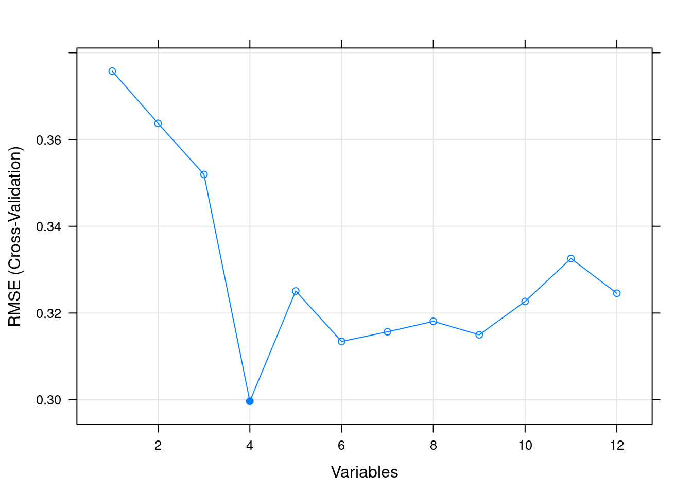
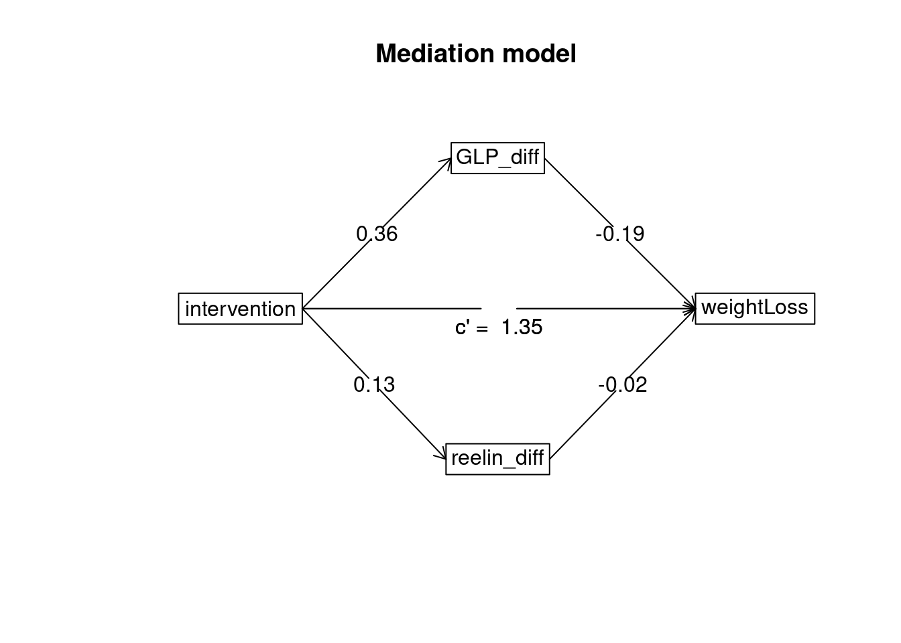
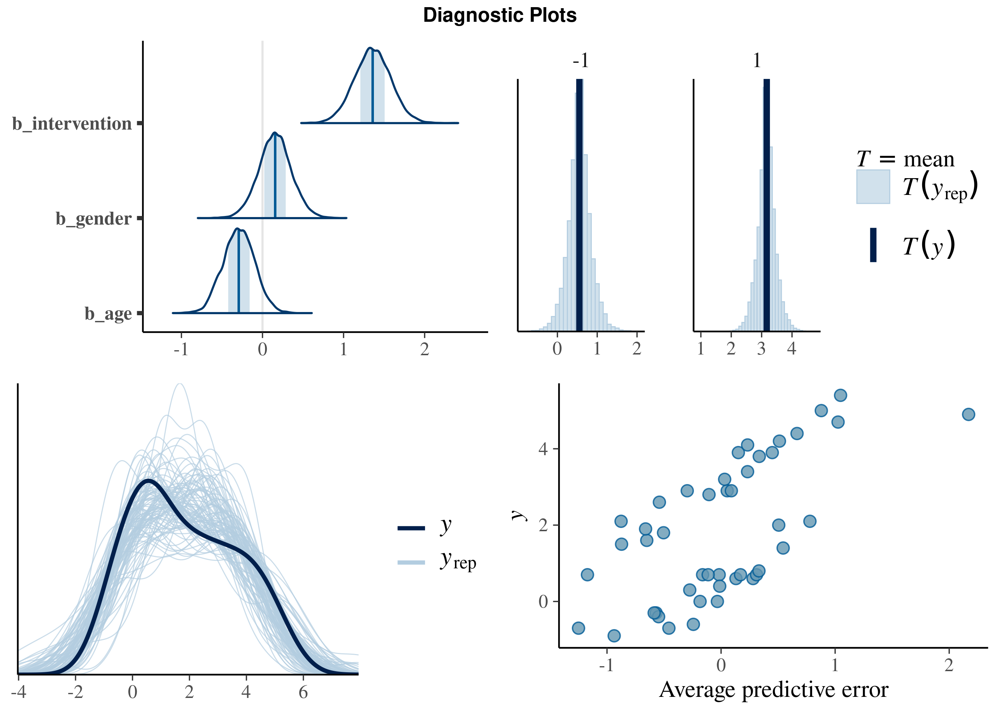
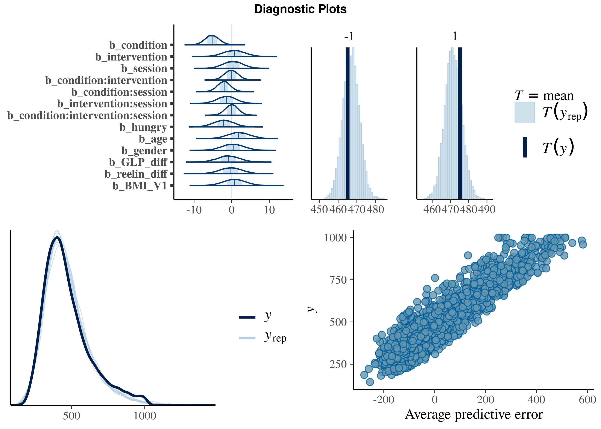
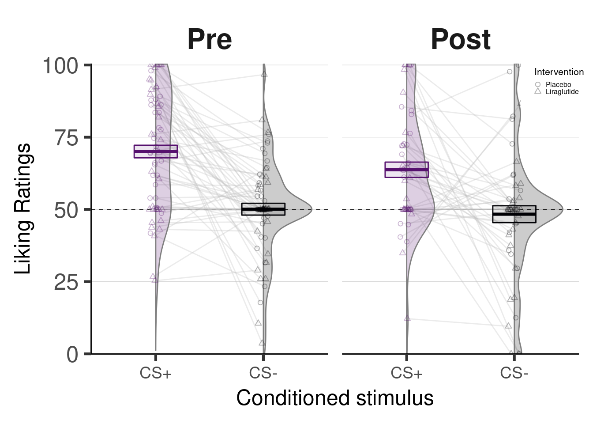

### Setup {-}
<!-- # TO DO -->
  

```r
library(repro)
# load packages from yaml header
automate_load_packages()
# include external scripts
automate_load_scripts()

# load data
intern  <- automate_load_data(intern, read.csv, stringsAsFactors = T)
medic    <- automate_load_data(medic, read.csv, stringsAsFactors = T)
PAV      <- automate_load_data(PAV, read.csv, stringsAsFactors = T)
INST     <- automate_load_data(INST, read.csv, stringsAsFactors = T)
PIT      <- automate_load_data(PIT, read.csv, stringsAsFactors = T)
HED      <- automate_load_data(HED, read.csv, stringsAsFactors = T)
HED_fMRI <- automate_load_data(HED_fMRI, read.csv, stringsAsFactors = T)

x = session_info();  opts_chunk$set(echo = FALSE, warning = FALSE, message = FALSE) # set F for all


## we recommend running this is a fresh R session or restarting your current session
#install.packages("cmdstanr", repos = c("https://mc-stan.org/r-packages/", getOption("repos")))
#install_cmdstan()


# check_git(); check_make(); check_docker() #check if installed

sessio = session_info(); #opts_chunk$set(echo = F, message=F, warning=F) # set echo F for all
```

This file was automatically created via `the Repro package (version 0.1.0)` using  R version 4.0.1 (2020-06-06)

<!-- May I suggest running `repro::automate()`? This will create a `Dockerfile` & `Makefile` based on every RMarkdown in this folder and the special yamls in them. date: "08 septembre, 2021" -->
<!-- add ENV DEBIAN_FRONTEND=noninteractive -->


### Description
TODO blabla\

<!-- Parametric Bootstrap Test method to evaluate significance of fixed effects in mixed-effects models (using MLE fit, nsim = 5000) and Bayes Factor from mixed models (see Wagenmakers, 2007) -->

### Demographics
<table class="table" style="width: auto !important; margin-left: auto; margin-right: auto;">
<caption>Summary statistics</caption>
 <thead>
  <tr>
   <th style="text-align:left;font-weight: bold;text-align: center;">  </th>
   <th style="text-align:left;font-weight: bold;text-align: center;"> Placebo M (SD)/N (%) </th>
   <th style="text-align:left;font-weight: bold;text-align: center;"> Liraglutide M (SD)/N (%) </th>
   <th style="text-align:left;font-weight: bold;text-align: center;"> Test </th>
  </tr>
 </thead>
<tbody>
  <tr>
   <td style="text-align:left;"> BMI </td>
   <td style="text-align:left;"> 35.08 (2.96) </td>
   <td style="text-align:left;"> 35.74 (2.93) </td>
   <td style="text-align:left;"> t(df=47) = -0.78, p = .438, d = 0.22 </td>
  </tr>
  <tr>
   <td style="text-align:left;"> AGE </td>
   <td style="text-align:left;"> 40.27 (13.74) </td>
   <td style="text-align:left;"> 38.61 (11.72) </td>
   <td style="text-align:left;"> t(df=47) = 0.45, p = .653, d = 0.13 </td>
  </tr>
  <tr>
   <td style="text-align:left;"> GENDER </td>
   <td style="text-align:left;">  </td>
   <td style="text-align:left;">  </td>
   <td style="text-align:left;"> Chi-square = 0.35, df = 1, p = .556, Phi = 0.08 </td>
  </tr>
  <tr>
   <td style="text-align:left;"> Men </td>
   <td style="text-align:left;"> 10 (38.5) </td>
   <td style="text-align:left;"> 7 (30.4) </td>
   <td style="text-align:left;">  </td>
  </tr>
  <tr>
   <td style="text-align:left;"> Women </td>
   <td style="text-align:left;"> 16 (61.5) </td>
   <td style="text-align:left;"> 16 (69.6) </td>
   <td style="text-align:left;">  </td>
  </tr>
</tbody>
</table>

### Biomedical data

#### Variable Selection  {-}
<div class="figure" style="text-align: center">

<p class="caption">Box-plot of all biomedical predictors per intervention.</p>
</div>
\

Recursive Feature Eliminations 

```
## [1] "BMI_diff"    "BW_diff"     "reelin_diff" "GLP_diff"
```



#### Mediation analysis  {-}


<table class="table" style="width: auto !important; margin-left: auto; margin-right: auto;">
<caption>Mediation Analysis: DV = Weight loss, IV = Intervention</caption>
 <thead>
  <tr>
   <th style="text-align:left;">   </th>
   <th style="text-align:left;">  </th>
   <th style="text-align:left;"> Estimates </th>
   <th style="text-align:left;"> 95% CI </th>
   <th style="text-align:left;"> p </th>
  </tr>
 </thead>
<tbody>
  <tr>
   <td style="text-align:left;"> 1 </td>
   <td style="text-align:left;"> Indirect effect mediated through GLP_diff </td>
   <td style="text-align:left;"> 0.017 </td>
   <td style="text-align:left;"> (-0.280, 0.325) </td>
   <td style="text-align:left;"> <span> 0.919 </span> </td>
  </tr>
  <tr>
   <td style="text-align:left;"> 2 </td>
   <td style="text-align:left;"> Indirect effect mediated through reelin_diff </td>
   <td style="text-align:left;"> 0.048 </td>
   <td style="text-align:left;"> (-0.104, 0.249) </td>
   <td style="text-align:left;"> <span> 0.535 </span> </td>
  </tr>
  <tr>
   <td style="text-align:left;"> 5 </td>
   <td style="text-align:left;"> Direct effect </td>
   <td style="text-align:left;"> 1.426*** </td>
   <td style="text-align:left;"> (0.964, 1.908) </td>
   <td style="text-align:left;"> <span style=" font-weight: bold;    ">&lt; 0.001</span> </td>
  </tr>
  <tr>
   <td style="text-align:left;"> 6 </td>
   <td style="text-align:left;"> Total effect </td>
   <td style="text-align:left;"> 1.491*** </td>
   <td style="text-align:left;"> (1.018, 2.006) </td>
   <td style="text-align:left;"> <span style=" font-weight: bold;    ">&lt; 0.001</span> </td>
  </tr>
</tbody>
</table>



### Weight Loss





```
## [1] "Bayesian linear mixed model (estimated using MCMC sampling with  4  chains of 5000  iterations and a warmup of 1000 ) to predict weightLoss with intervention, gender, age, GLP_diff and reelin_diff (formula: weightLoss ~ intervention + gender + age + GLP_diff + reelin_diff). The model included id as random effect (formula: ~1 | id). Priors over parameters were set as normal (mean = 0.00, SD = 3.00), and student_t (location = 0.00, scale = 2.50) distributions"
```

```
## Summary of Posterior Distribution
## 
## Parameter    | Median |  MAD |        90% CI |     pd |  Rhat |     BF
## ----------------------------------------------------------------------
## intervention |   1.38 | 0.24 | [ 1.03, 1.80] |   100% | 1.015 | > 1000
## gender       |   0.14 | 0.21 | [-0.21, 0.47] | 73.99% | 1.005 |  0.089
## age          |  -0.29 | 0.19 | [-0.63, 0.01] | 93.39% | 1.001 |  0.232
## GLP_diff     |  -0.20 | 0.29 | [-0.70, 0.26] | 76.31% | 1.008 |  0.126
## reelin_diff  |  -0.04 | 0.30 | [-0.54, 0.45] | 54.71% | 1.006 |  0.105
```

```
## [1] "- b_intervention (Median = 1.38, 90% CI [1.03, 1.80]) has a 100.00% probability of being positive (> 0), 100.00% of being significant (> 0.09), and 99.98% of being large (> 0.54)"
```

```
## 
## ------------------------------------
##  ICC    N id   Observations    R2   
## ------ ------ -------------- -------
##  0.16    45         45        0.730 
## ------------------------------------
```

#### Plot Weight Loss {-}
<div class="figure" style="text-align: center">

<p class="caption">Weight Loss by intervention.</p>
</div>
\
\


### Pavlvovian Conditioning Task 

#### Latency {-}
Latency = time to detect the target (ms) & condition = CS+ or CS-





```
## [1] "Bayesian general linear mixed model (exgaussian family with a identity link) (estimated using MCMC sampling with  4 chains of 5000 iterations and a warmup of 1000 ) to predict Latency with condition, intervention, session, age, gender, BMI_V1, hungry, GLP_diff and reelin_diff (formula: RT ~ condition * intervention * session + age + gender + BMI_V1 + hungry + GLP_diff + reelin_diff). The model included condition, session, id and trialxcondition as random effects (formula: list(~condition * session | id, ~1 | trialxcondition)). Priors over parameters were set as normal (mean = 0.00, SD = 3.00), and student_t (location = 0.00, scale = 130.20) distributions"
```

```
## Summary of Posterior Distribution
## 
## Parameter                      | Median |  MAD |         90% CI |     pd |  Rhat |    BF
## ----------------------------------------------------------------------------------------
## condition                      |  -5.21 | 1.87 | [-8.22, -1.98] | 99.51% | 1.001 | 20.34
## intervention                   |   0.61 | 2.90 | [-4.39,  5.17] | 58.91% | 1.000 | 0.991
## session                        |   0.36 | 2.51 | [-3.81,  4.47] | 55.83% | 1.000 | 0.849
## age                            |   1.95 | 2.95 | [-2.73,  6.85] | 74.52% | 1.001 |  1.19
## gender                         |   0.33 | 2.92 | [-4.34,  5.20] | 54.49% | 1.000 | 0.944
## BMI_V1                         |   0.74 | 2.94 | [-4.09,  5.51] | 59.89% | 1.000 |  1.00
## hungry                         |  -2.11 | 2.73 | [-6.86,  2.17] | 78.03% | 1.001 |  1.22
## GLP_diff                       |  -0.83 | 2.94 | [-5.57,  4.20] | 61.30% | 1.000 |  1.04
## reelin_diff                    |  -0.23 | 2.93 | [-4.98,  4.69] | 53.17% | 1.000 | 0.996
## condition:intervention         |  -0.12 | 1.81 | [-3.12,  2.88] | 52.79% | 1.000 | 0.604
## condition:session              |  -2.03 | 1.73 | [-4.91,  0.83] | 87.26% | 1.000 |  1.19
## intervention:session           |  -1.39 | 2.54 | [-5.43,  2.87] | 69.93% | 1.000 |  1.03
## condition:intervention:session |   0.05 | 1.71 | [-2.74,  2.86] | 51.00% | 1.000 | 0.543
```

```
## [1] "- b_condition (Median = -5.21, 90% CI [-8.22, -1.98]) has a 99.51% probability of being negative (< 0), 99.49% of being significant (< -0.05), and 99.27% of being large (< -0.30)"
```

```
## 
## --------------------------------------------------------
##  ICC    N id   N trialxcondition   Observations    R2   
## ------ ------ ------------------- -------------- -------
##  1.00    50           20               3223       0.204 
## --------------------------------------------------------
```
\

#### Plot Latency {-}
<div class="figure" style="text-align: center">

<p class="caption">A) Posterior distribution by Pavlovian cue. B) Highest density interval (90% HDI) of the posterior distribution difference for the latency to respond between CS+ and CS-</p>
</div>


#### Perceived liking (Pavlovian Cue) {-}

Ratings = how pleasant is the clue (0-100, no repetitions)   &   condition = CS+ or CS-


```
## [1] "Bayesian linear mixed model (estimated using MCMC sampling with 4  chains of 5000  iterations and a warmup of 1000 )  to predict liking with condition, intervention, session, age, gender, BMI_V1, hungry, GLP_diff and reelin_diff (formula: liking ~ condition * intervention * session + age + gender + BMI_V1 + hungry + GLP_diff + reelin_diff). The model included condition, session and id as random effects (formula: ~condition * session | id). Priors over parameters were set as normal (mean = 0.00, SD = 3.00), and student_t (location = 0.00, scale = 15.10) distributions"
```

```
## Summary of Posterior Distribution
## 
## Parameter                      | Median |  MAD |         90% CI |     pd |  Rhat |     BF
## -----------------------------------------------------------------------------------------
## condition                      |   6.85 | 1.64 | [ 4.10,  9.58] |   100% | 1.000 | 575.57
## intervention                   |  -1.88 | 1.28 | [-3.95,  0.26] | 92.73% | 1.000 |   1.26
## session                        |  -1.95 | 1.02 | [-3.62, -0.26] | 97.01% | 1.000 |   2.07
## age                            |   1.50 | 1.19 | [-0.41,  3.52] | 89.69% | 1.000 |  0.903
## gender                         |   0.02 | 1.28 | [-2.12,  2.10] | 50.74% | 1.000 |  0.431
## BMI_V1                         |   0.40 | 1.31 | [-1.83,  2.49] | 62.06% | 1.000 |  0.442
## hungry                         |   4.62 | 1.12 | [ 2.75,  6.46] |   100% | 1.000 | 285.46
## GLP_diff                       |   0.41 | 1.64 | [-2.29,  3.01] | 59.61% | 1.000 |  0.564
## reelin_diff                    |  -0.40 | 1.62 | [-3.13,  2.32] | 59.55% | 1.000 |  0.585
## condition:intervention         |   0.41 | 1.60 | [-2.30,  2.95] | 60.28% | 1.000 |  0.543
## condition:session              |  -0.39 | 0.99 | [-1.99,  1.29] | 65.21% | 1.000 |  0.344
## intervention:session           |   0.29 | 1.00 | [-1.32,  1.96] | 61.61% | 1.000 |  0.343
## condition:intervention:session |   1.07 | 0.97 | [-0.58,  2.63] | 86.54% | 1.000 |  0.587
```

```
## [1] "- b_condition (Median = 6.85, 90% CI [4.10, 9.58]) has a 100.00% probability of being positive (> 0), 99.97% of being significant (> 1.05), and 63.34% of being large (> 6.29)"
## [2] "- b_hungry (Median = 4.62, 90% CI [2.75, 6.46]) has a 100.00% probability of being positive (> 0), 99.84% of being significant (> 1.05), and 6.79% of being large (> 6.29)"
```

```
## 
## ------ ------ -------------- -------
##  ICC    N id   Observations    R2   
## 
##  0.55    50        184        0.681 
## ------ ------ -------------- -------
```
\
\


#### Plot Perceived liking (Pavlovian Cue) {-}
<div class="figure" style="text-align: center">

<p class="caption">A) Posterior distribution by Pavlovian cue. B) Highest density interval (90% HDI) of the posterior distribution difference for the latency to respond between CS+ and CS-</p>
</div>
\
\


### Instrumental Conditioning Task
grips = number of times participant exceeded the force threshold to acquire the reward (Milkshake)
\


